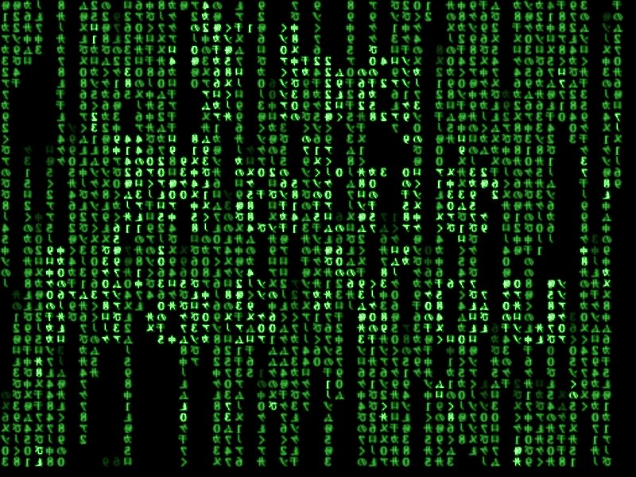
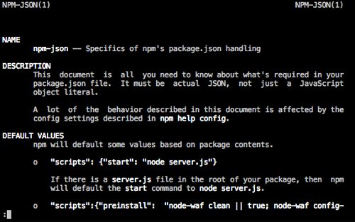

% Taller de Bash Inicial
% Juan Pablo Darago - Julian Sackmann - Pablo Antonio
% \today

# Introducción

## ¡Bienvenidos!

* Hoy vamos a dar los primeros pasos con la terminal.
* Marco: Talleres de "cosas útiles"
    * ComCom!
    * __Com__isión de __Com__putadores.
* Primer paso: aprender a usar la consola.
    * Olvidarnos de la GUI por un rato.

## ¿Qué es la terminal?

* El coso negro con letras verdes.

## ¿Qué es la terminal?

## ¿Que es la terminal?

## ¿Que es la terminal?
* Antes de los manejadores de ventanas, existia la terminal.
* Interprete de comandos.
    * Recibir una linea que dice que programa correr y como.
    * Correr ese programa.
* Interfaz entre el usuario y los otros programas.
    * A veces parte del sistema operativo (DOS).
    * ...Idealmente no (UNIX).

## Y ahora el que habla se siente

## Motivación

* Vamos a hacer una mini-encuesta.

## Motivación
* ¿Por qué vamos a ver la terminal si puedo hacer lo mismo con el mouse?
    * Porque usar el mouse es __lento__.

## ¿Para que sirve la terminal?

* La terminal brilla en combinar comandos.
    * "Programs should do one thing and one thing only" - Unix Philosophy.
    * Juntarlos para lograr lo que queremos.
* Juntar comandos en _scripts_.
    * Una tarea es ahora instántanea y repetible.
    * Documentar como se hace una cierta cosa.

## ¿En dónde corre la terminal?

* La terminal necesita programas para correr.
* Necesita un sistema operativo para proveer a los programas.
    * El acceso al sistema de archivos.
    * A la red.
    * A la pantalla.
    * etc.
* En Unix, la terminal __es un programa mas__.
    * Usa el SO para levantar otros programas.

## ¿Que terminales hay?

* Al ser un programa, hay muchas variantes.
    * Ejemplos: sh, bash, zsh, fish, tcsh, csh, ksh, ...
    * Nosotros vamos a usar bash.
    * Prueben zsh si tienen ganas.
* Variantes:
    * Scripteabilidad
    * _Autocompletion_.
    * _Plugins_ y extensibilidad.
* Los programas que abren una terminal no son la terminal.
    * Ejemplo: GNOME Terminal, XTerm, ITerm, ...

# Presentandonos

## ¡Empecemos!

* Vamos a usar Bash: es un excelente promedio entre:
    * Masividad (viene preinstalado en casi todos lados: Ubuntu, Debian, OS X).
    * Funcionalidad
* No es tan facil de adaptar para PowerShell o Cygwin.
    * Pero [babun https://github.com/babun/babun] hace maravillas
* Primero la presentamos y despues vamos a ver conceptos.
* Una última cosa: _man_.

## Demo inicial

¡Con ustedes la terminal!

# Conceptos importantes

## _Filesystem_

* Consiste de archivos organizados en directorios.
* Hay un directorio raiz, el "/".
* Cada usuario tiene un directorio suyo en el "/home/"
* Cada usuario tiene archivos especiales sobre sus preferencias.
    * en ".bashrc" las preferencias de Bash.
* Algunos archivos por defecto son ocultos.
    * Todo lo que empiece con "."
* ¡DEMO!

<!-- Touch > >> cat more less echo grep -->

## _Procesos_

* Cuando corremos un programa creamos un proceso.
    * El shell busca el programa y lo corre como proceso.
* El proceso ejecuta hasta que termina o le mandan una señal.
    * Para suspenderlo, forzarlo a terminar, etc.
* Podemos ver los procesos corriendo con _ps_, _top_ o _htop_.
* Podemos enviar una señal a un proceso con _kill_.
    * Para eso necesitamos su PID (Process ID).
* ¡DEMO!

## _Usuarios_

* El sistema tiene multiples usuarios.
* Cada usuario es dueño de recursos:
    * Sus archivos.
    * Sus procesos.
* El superusuario _root_ puede hacer lo que quiera.
* El acceso a un archivo esta mediado por sus permisos.
    * Permisos para el _owner_.
    * Permisos para el _group_ del _owner_.
    * Permisos para los demas.
* Los permisos indican si se puede escribir, leer o ejecutar.
* El owner y group se cambia con _chown_ y _chmod_.
* Los permisos con _chmod_.
* ¡DEMO!

## _Editores_

* Hay editores de texto solo para la terminal.
* No necesitan cliente de terminal, se pueden usar por ssh.
* Lo mas populares son:
    * _nano_: Util y productivo, facil de usar.
    * _vim_: Modal, muy productivo, curva de aprendizaje media.
    * _emacs_: Muy poderoso, curva de aprendizaje alta.

## _Maquinas remotas_

* Podemos conectarnos a maquinas externas.
* Usando para eso _ssh_ (Secure Shell).
    * Nuestro programa _ssh_ habla con otro programa (_sshd_) en
    la otra maquina que interpreta los comandos.
    * Simplemente ejecuta _bash_ y manda las cosas por la red.
    * Encriptado y muy seguro: no pueden mirar lo que hacemos.
* Pueden conectarse a las maquinas de los labos desde afuera con _ssh_.
    * Usando el servidor _milagro_.
    * ¡DEMO!
* También pueden copiar archivos por SCP.
    * ¡DEMO!

## Un par de tips
* Aliasing
* TMUX
* _man pages_
    * Ya se que lo dijimos, pero ¡posta es importante!

# Bueno, ¡A practicar!

## Ejercitación.

* Ahora vamos a hacer ejercicios prácticos.
* No estan subidos a ningun lado:
    * ¡Tienen que copiar los comandos a mano!
* Para algunos ejercicios van a necesitar un zip de cubawiki.
    * Cualquier cosa este es el link: http://cubawiki.com.ar/tallerBash.tar.gz

## Pedir ayuda:
* Si necesitan ayuda pueden:

## Pedir ayuda:

## Pedir ayuda:

## Pedir ayuda:

## Pedir ayuda:
* Preguntarnos a nosotros!
    * O a cualquiera de los chicos que generosamente se ofrecieron a ayudarnos.
* Aunque no sabemos tanto como Google...
* ...ni como las man pages...
* ...pero seguro que dirigimos fútbol mejor que Nishimura.

## A trabajar
* ¡Arranquemos!
